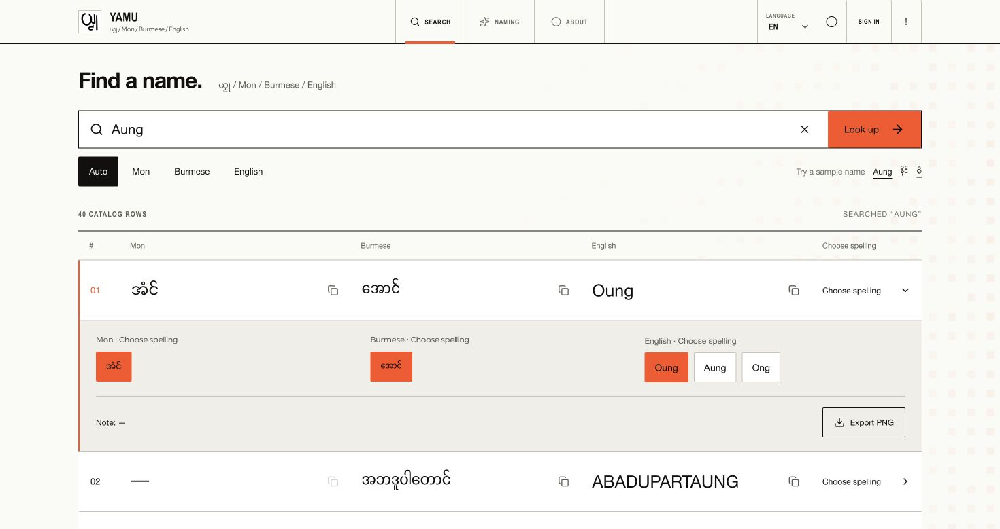
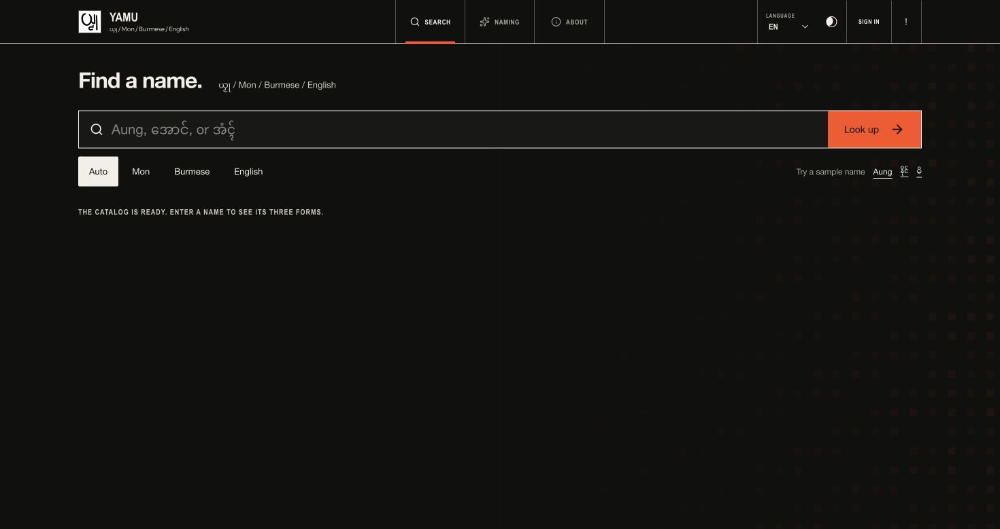
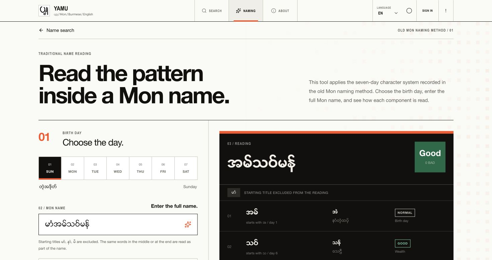

<div align="center">
  

  <h1>Yamu · ယၟု</h1>

  <p><strong>A home for Mon names across Mon, Burmese, and English.</strong></p>

  <p>Search spellings, explore name variants, and read traditional Mon naming patterns in one place.</p>

  <p><a href="https://yamumon.com">Explore Yamu</a> · <a href="https://yamumon.com/naming">Naming tool</a> · <a href="#run-locally">Run locally</a></p>
</div>

<br>



<p align="center"><sub>Search across three languages, compare spellings, and export a selected name.</sub></p>

## Discover Yamu

| Search and compose | Read a Mon name |
| --- | --- |
| Find names in Mon, Burmese, or English. Automatic script detection helps you start in the language you know. Combine catalog entries into a full name while keeping their order. | Choose a birth day and enter a Mon name to see how its components are read through the traditional seven-day character system. |
|  |  |

The interface is available in **Mon, Burmese, and English**. Mon and Burmese text uses the bundled Z20 KhitHaungg font.

### What you can do

- **Explore spellings:** Compare Mon, Burmese, and English variants, select the one you prefer, and copy individual names.
- **Share a name:** Export the selected trilingual result as a PNG image.
- **Improve the catalog:** Suggest a missing word with optional contributor credit or report an issue from a public page.
- **Work offline:** Install the production site as a PWA; an offline screen appears when the connection is unavailable.

## Run locally

You need **Node.js 22** and **npm**. From the repository root:

```bash
cp .env.example .env.local
npm install
npm run dev
```

Add your Clerk keys to `.env.local`, then open [Search](http://localhost:3002), [Naming](http://localhost:3002/naming), or [Admin](http://localhost:3002/admin).

```dotenv
NEXT_PUBLIC_CLERK_PUBLISHABLE_KEY=pk_test_replace_me
CLERK_SECRET_KEY=sk_test_replace_me
APP_ORIGINS=http://localhost:3002
PORT=3002
```

The remaining Clerk route settings are already listed in [`.env.example`](.env.example). Keep `/sign-up` configured for invitation links even though the public interface does not offer self-service registration. Set both Clerk Development and Production instances to **Invite-only** access. The first Clerk user becomes an administrator; that user can invite teammates and assign roles from **Team & roles**.

For production, use Clerk production keys and set `APP_ORIGINS` to the exact HTTPS origins, separated by commas if needed. `DATA_DIR` can point to a persistent writable directory; otherwise the app uses `data/`. `INITIAL_CATALOG_PATH` optionally points to a different portable catalog. Set `TRUST_CLOUDFLARE_PROXY=true` only when direct origin access is blocked and requests come through Cloudflare. `REACTBITS_LICENSE_KEY` is used when installing licensed shadcn registry components and is not required at runtime.

Service-worker registration is enabled in production. Build and start the app to test installation from localhost or an HTTPS deployment:

```bash
npm run build
npm start
```

Public pages use network-first caching. Admin and API requests are never cached.

## Manage the catalog

The admin area supports manual entries, edits, deletions, contribution review, bug-report triage, branding, and exports. Catalog browsing loads 200 records at a time; the full catalog can be exported as **CSV, XLSX, or JSON**.

### Import a spreadsheet

Upload a `.csv`, `.xls`, or `.xlsx` file, map its columns, preview the rows, then choose **append** or **replace**. Required fields are `mon`, `burmese`, and `english`; `notes` and `credit` are optional. Header aliases such as `mnw`, `myanmar`, `en`, `remarks`, and `contributor` are recognized, and columns can be remapped in the browser.

Use commas, semicolons, pipes, or line breaks to separate spelling variants in a cell. The first spelling is the default. Start with the [CSV template](public/templates/names-template.csv). The most recent spreadsheet import can be undone.

| Role | Access |
| --- | --- |
| **Admin** | Full catalog, imports, reviews, branding, and team roles |
| **Manager** | Catalog, deletion, imports, exports, and review queue |
| **Editor** | Catalog create/edit and exports |

Administrators can change the site name, tagline, accent color, header logo, and favicon from **Brand Settings**. The repository defaults are [`public/yamu-logo.png`](public/yamu-logo.png) and [`public/favicon.png`](public/favicon.png).

## Data and sources

| File | Purpose |
| --- | --- |
| `data/names.db` | SQLite catalog and private bug reports |
| `data/names.json` | Portable catalog, including spelling variants and approved contributor credit |
| `data/branding.json` | Brand settings |
| `data/branding/` | Uploaded brand assets |

Yamu initializes a new database from `data/names.json`, or from a small sample seed if no portable catalog is available. Imports, edits, deletions, manual additions, and approved contributions sync back to the JSON catalog. Bug reports stay private in SQLite.

SQLite uses write-ahead logging. When backing up a running instance, include `names.db-wal` and `names.db-shm` or use a SQLite-aware backup method. Back up the branding file and directory to preserve uploaded assets.

### Myanmar name source

The Burmese and English fallback records come from [TaoMonLae/Myanmar-Name_en-2-mm](https://github.com/TaoMonLae/Myanmar-Name_en-2-mm), licensed under **CC BY-NC-ND 4.0**. Rows sharing a Myanmar spelling are grouped so English Romanizations remain selectable. Existing trilingual Yamu records take priority; fallback records leave Mon blank until an administrator verifies the equivalent.

To rebuild that batch from a downloaded copy of the source repository:

```bash
npm run import:myanmar-names -- /path/to/MyanmarName-en-mm.csv
```

The source license restricts commercial use and distribution of adaptations. Confirm permission before publishing a derived catalog or using it commercially.

## Development and deployment

| Command | Purpose |
| --- | --- |
| `npm run dev` | Start the development server on port 3002 |
| `npm run build` | Create a production build |
| `npm start` | Start the production server |
| `npm run lint` | Run ESLint |
| `npm test` | Run the test suite |
| `npx tsc --noEmit` | Check TypeScript |

Yamu builds as a standalone Next.js server with a disk-backed catalog. The [Ubuntu deployment guide](deploy/UBUNTU.md) covers Node.js, PM2, nginx, TLS, persistent data, and backups. GitHub Actions verifies pushes, pull requests, and published releases; stable semantic releases deploy their exact tag to the configured `production` environment.

The app limits request and upload sizes, throttles public contributions, validates state-changing requests, checks Clerk sessions and roles on the server, and sends a nonce-based Content Security Policy. Bind the production process to `127.0.0.1` behind nginx or Cloudflare Tunnel. Cloudflare edge rate limiting is recommended because the built-in limiter is per Node process.

## License

Yamu's original software and documentation are available under the [MIT License](LICENSE). Catalog data, fonts, photos, logos, favicons, and app icons have separate terms. Read [Third-Party Notices](THIRD_PARTY_NOTICES.md) before redistributing the project or using its data and assets commercially.
